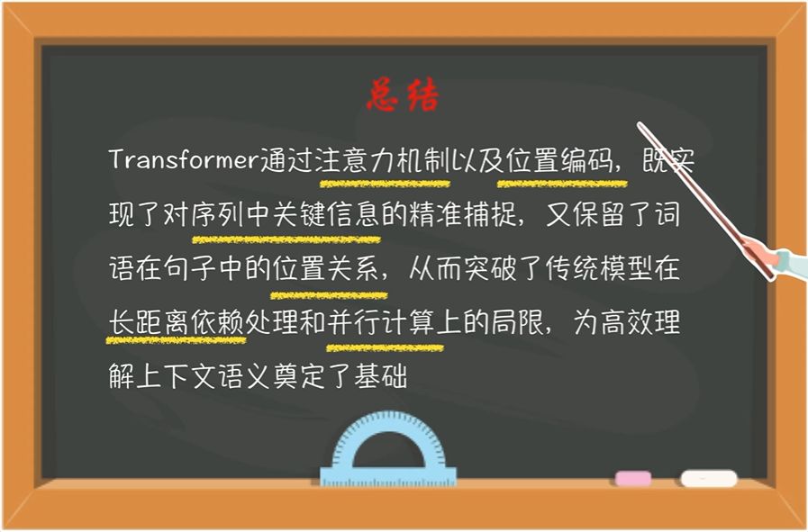
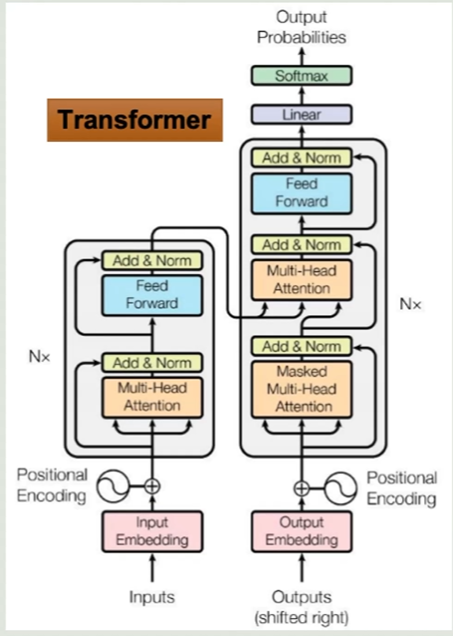

👉 [返回首页](/)

# CNN

# RNN

# Transformer

> 优化分为两类：encoder编码器 和 decoder解码器

## Bert (encoder)
- 双向编码器,从左右两个方向理解句子含义
- 擅长文本分类，关键词提取，语义匹配

## GPT (decoder)
- 单向生成，单向注意力
- 只能看前面已经生成的词，不能看后面还没写的词
- 掩码机制
    - 屏蔽未来词
    - 符合时序逻辑
- 预训练 与 微调
    - 预训练：大规模语料库，学习语言模型
    - 微调：在特定任务上进行训练，提升性能