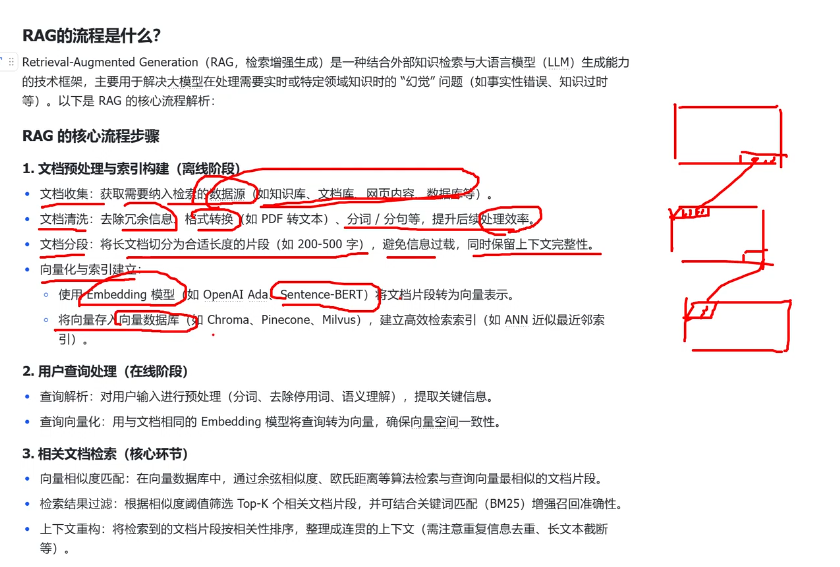
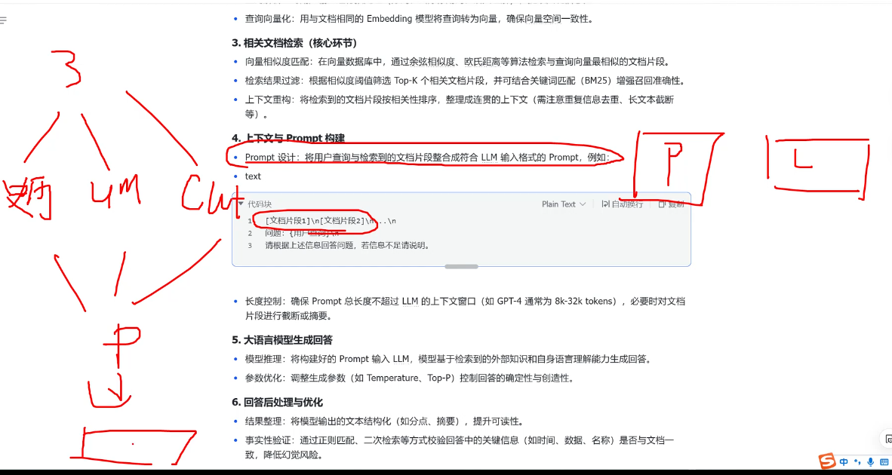
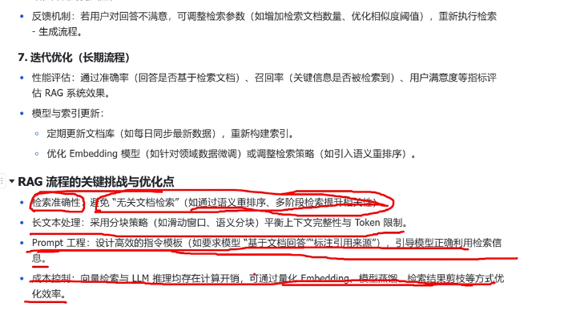
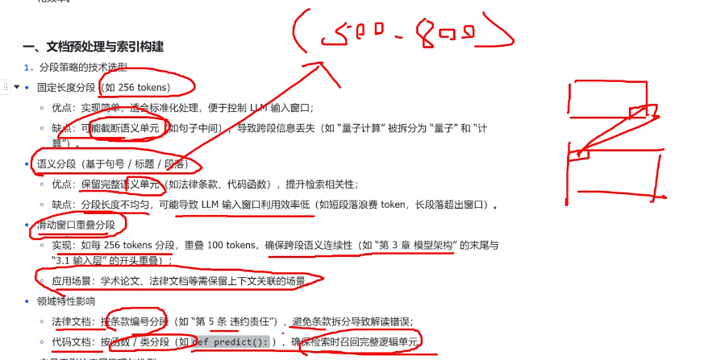
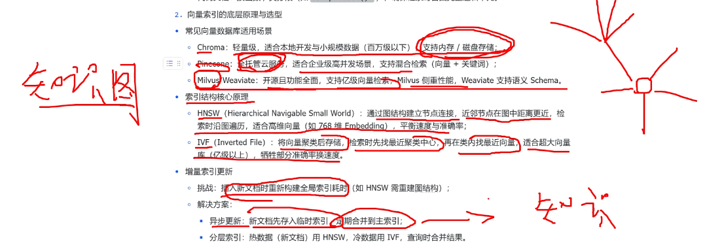
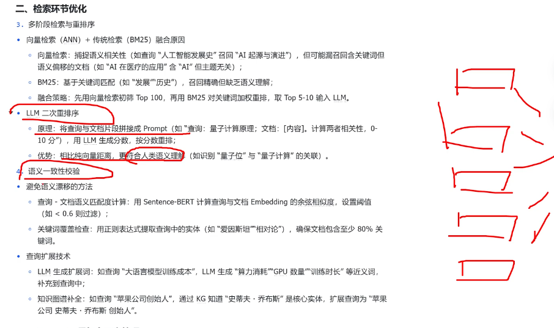
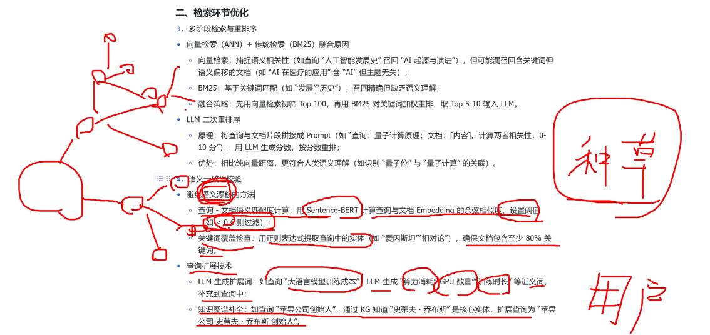

👉 [返回首页](/)

# CNN

# RNN

# Transformer

> 优化分为两类：encoder编码器 和 decoder解码器

## Bert (encoder)
- 双向编码器,从左右两个方向理解句子含义
- 擅长文本分类，关键词提取，语义匹配

## GPT (decoder)
- 单向生成，单向注意力
- 只能看前面已经生成的词，不能看后面还没写的词
- 掩码机制
    - 屏蔽未来词
    - 符合时序逻辑
- 预训练 与 微调
    - 预训练：大规模语料库，学习语言模型
    - 微调：在特定任务上进行训练，提升性能

# 面试 （一面）

## Transformer
Transformer 是一种完全基于 Attention 的序列建模架构，抛弃了 RNN/CNN，通过 Self-Attention 建模全局依赖，并支持并行计算。

- self-attention 机制 O(n²)
    - 计算序列中每个位置对其他位置的注意力权重
    - 捕捉长距离依赖关系

为什么 Transformer 比 RNN / GRU / LSTM 强？
并行计算（不依赖时间步）

- 长距离依赖（无梯度消失问题）
- 表达能力强
- 更适合大规模数据和预训练

# RNN
RNN（Recurrent Neural Network）是一类用于序列建模的神经网络，通过循环结构让当前状态依赖于历史状态。

# 面试 （二面）

## 必问模块 ①：Python 工程 & 并发（高概率）

GIL 是什么？什么时候影响你？

IO 密集 vs CPU 密集怎么区分？

线程 / 进程 / 协程怎么选？

生成器 / 迭代器的工程意义？

单例模式为什么要用？线程安全吗？

深拷贝 / 浅拷贝常见坑

## 必问模块 ②：Transformer & LLM

Transformer 和 RNN/LSTM/GRU 的本质区别？

Self-Attention 在算什么？

为什么是 O(n²)？

Decoder-only 为什么适合 Agent？

KV Cache 是什么？解决什么问题？

推理阶段和训练阶段有什么不同？

## 必问模块 ③：AI Agent 核心

什么是 AI Agent？和普通模型的区别？
- AI Agent 不只是模型调用，而是一个具备感知、决策、执行和状态管理能力的系统。
模型负责生成和推理，而 Agent 负责管理上下文、调用工具、维护状态并控制执行流程。
- Agent = 模型 + Memory + Tools + Planner + Controller

一个 Agent 系统包含哪些模块？
- 1）模型接口层（LLM / Vision / Speech）
- 2）状态与记忆管理（短期 / 长期 memory）
- 3）工具调用与结果解析
- 4）规划与执行控制（step-by-step / loop control）
- 5）并发、重试、超时与失败兜底机制

Agent 的 memory 怎么设计？

Tool calling 是怎么实现的？

多轮对话状态如何管理？

Agent 怎么避免无限循环/幻觉？

## 必问模块 ④：系统设计题

设计一个支持多用户的 Agent 系统

Agent 如何并发处理多个任务？

Agent 如何限流、重试、失败回退？

模型调用慢怎么办？

如何降低调用成本？

如何保证系统稳定性？

## 必问模块 ⑤：场景追问

Agent 调用工具失败怎么办？

返回结果不可信怎么办？

Agent 输出如何做校验？

用户 prompt 注入怎么防？

多 Agent 如何协作？

