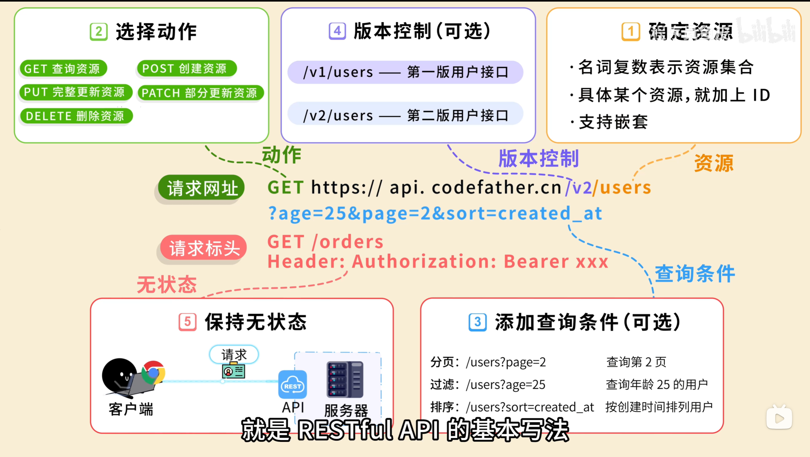
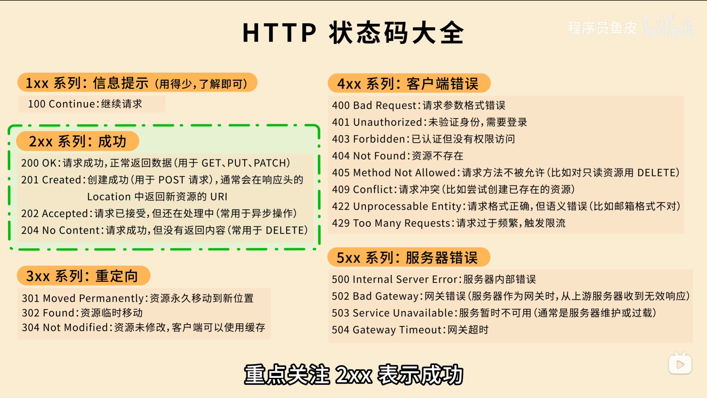
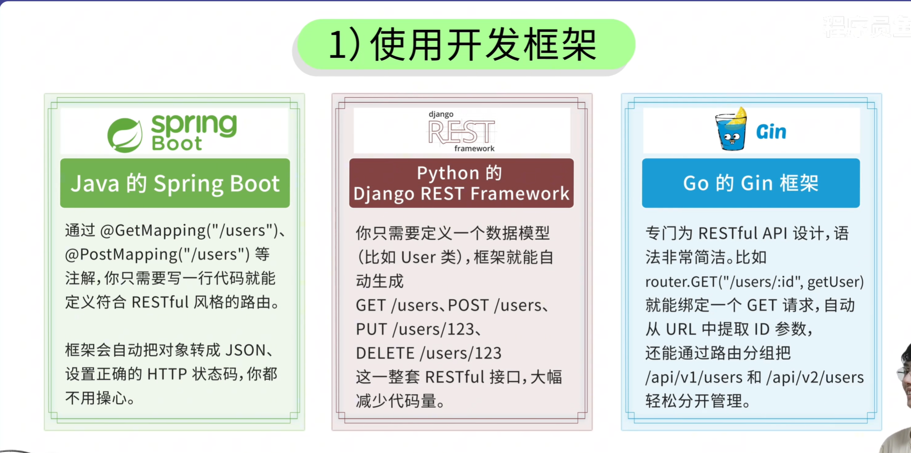
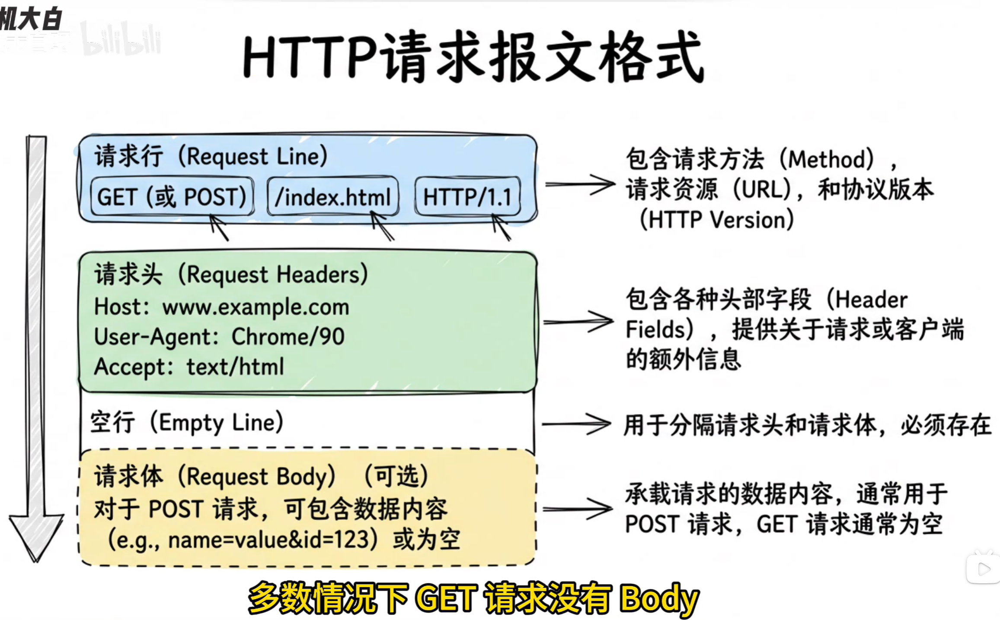
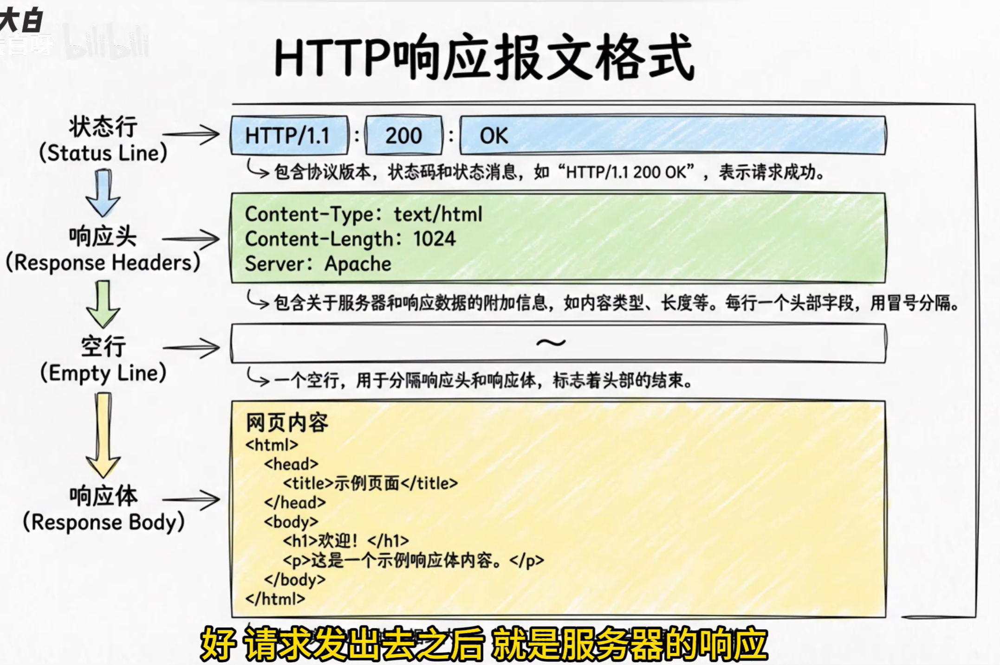
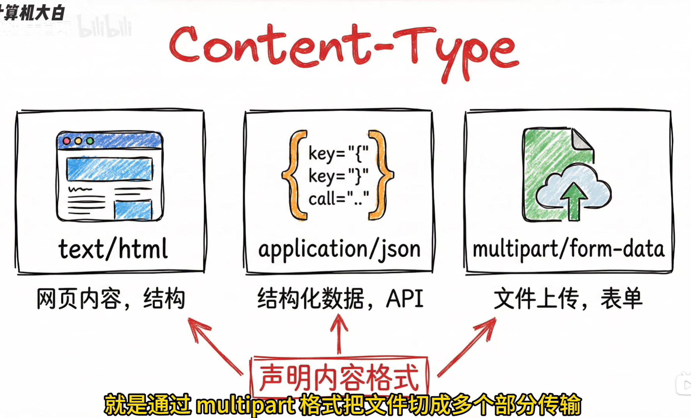

👉 [返回首页](/)

# restful api
## 设计原则

## 六大约束
建议风格（不绝对）

## 开发框架

可以使用插件： vscode 的 rest client

swagger 自动生成接口文档

# HTTP
## Http 状态码

## http 请求报文格式

## http 响应报文格式

## content-type

## http 与 https 区别
https 在 http 的基础上增加了 ssl/tls 加密传输层，保证数据传输的安全性和完整性。