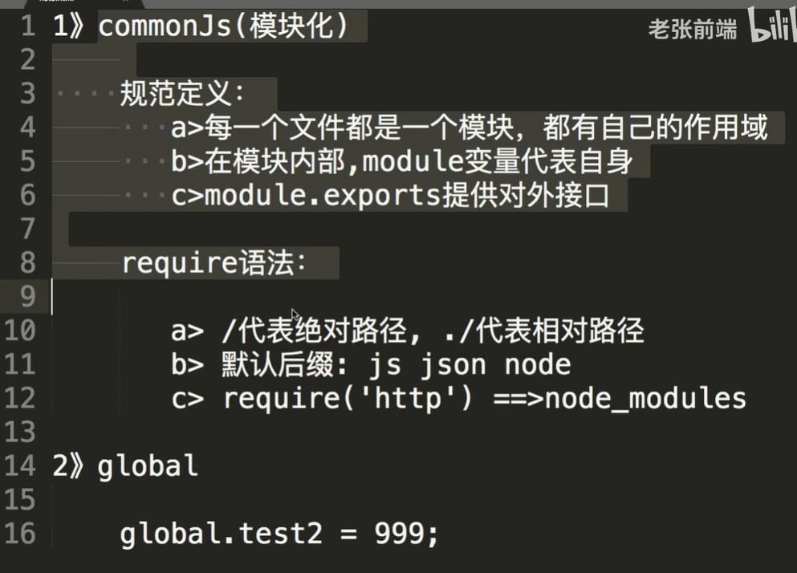

👉 [返回首页](/)
# 后端

引用http
```javascript
const http = require('http');
```

创建server
```javascript
const server = http.createServer( function(req, res) {
    res.end();
})
```

监听端口
```javascript
server.listen(3000, function(){
    console.log('服务已启动。。。');
})
```

引用 express 框架
```javascript
const express = require('express');
const app = express();
```

## 接口
get请求 路径位'/'
```javascript
app.get('/', function(req, res) {
    res.send('hello express 111');
})
```

某路径所有操作all
```javascript
app.all('/user', function(req, res) {

})
```

## 路径匹配类型
字符模式
```javascript
app.get('/a{b}cd', function(req, res) { //b可以出现也可以不出现
    res.send('a{b}cd 匹配成功');
})

app.get('/ab*cd', function(req, res) { //*通配符任意东西
    res.send('ab*cd 匹配成功');
})
```

正则模式
```javascript
app.get(/a/, function(req, res) {
    res.send('/a/ 正则匹配成功');
})

app.get(/.*fly$/, function(req, res) { //以fly结尾的路径都可以
    res.send('/.*fly$/ 正则匹配成功');
})
```

## 路由拆分
```javascript
app.get('/user/list', function(req,res) {
    res.send(['jack', 'lily'])
})
app.get('/user/detail', function(req, res) {
    res.send({
        name: 'jack',
        age: 18
    })
})

app.get('/goods/list', function(req,res) {
    res.send(['可乐', '矿泉水'])
})
app.get('/goods/detail', function(req, res) {
    res.send({
        name: '可乐',
        price: 3
    })
})
```

### 拆分
```javascript
const user = express.Router();
const goods = express.Router();

user.get('/list', function(req,res) {
    res.send(['jack', 'lily'])
})
user.get('/detail', function(req, res) {
    res.send({
        name: 'jack',
        age: 18
    })
})

goods.get('/list', function(req,res) {
    res.send(['可乐', '矿泉水'])
})
goods.get('/detail', function(req, res) {
    res.send({
        name: '可乐',
        price: 3
    })
})
```

### 注册路由
```javascript
app.use('/user', user)  //注册路由
app.use('/goods', goods)  //注册路由
```

## 中间件
一定要有next参数

### 全局中间件
```javascript
function middleware(req, res, next) {
    console.log('这是一个全局中间件函数。。。');
    next(); //放行
}

app.use(middleware); //注册全局中间件 所有路由都经过并运行
```

### 路由中间件
中间件放在接口参数中间
```javascript
app.get('/user', function(req, res, next) {
    console.log('这是user路由中间件。。。');
    next();
}, function(req, res) {
    res.send('user page');
})
```

### logging中间件
```javascript
function logger(req,res,next) {
    const time = new Date();
    console.log(`[${time.toLocaleString()}] ${req.method} ${req.url}`);
    next();
}

app.use(logger); //注册全局中间件
```


## 模板引擎

用npm install hbs安装

指定模板存放目录
```javascript
app.set('views', './views');
```

指定模板引擎
```javascript
app.set('view engine', 'hbs');

app.get('/', function(req, res) {
    throw new Error()
    res.render('index');
})

app.get('/about', function(req, res) {
    res.render('about', {
        name: 'jack',
        age: 18
    });
})
```

使用render方法渲染模板

在模板中使用双括号{{ }}插入数据
render第二个参数传数据对象，类json格式

静态资源服务
```javascript
app.use(express.static('public')); //指定静态资源目录
```

## 处理错误

### 404
放在最后，只有前面的匹配不上才会匹配 *
匹配所有路径
```javascript
app.use('/*path', function(req, res) {
    res.status(404).render('404', {url : req.originalUrl});
})

// or 正则
// app.use(/.*/, function(req, res) {
//     res.status(404).render('404', {url : req.originalUrl});
// })
```

### js内部错误处理
也要放在最后才能处理所有错误
```javascript
app.use((err, req, res, next) => {
    res.status(500).render('500')
})
```

# commoJS & global


后端中
get可以用req.url获取参数
post可以用req.on('data')获取参数
req.end()表示数据接收完毕