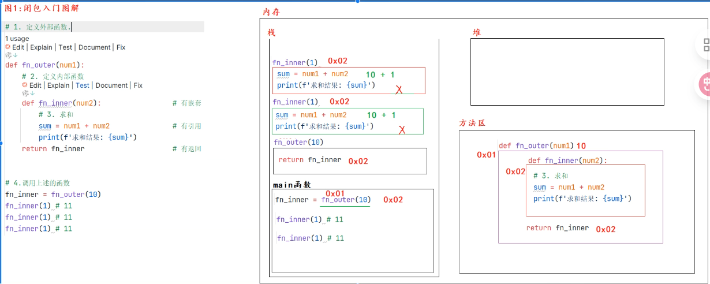
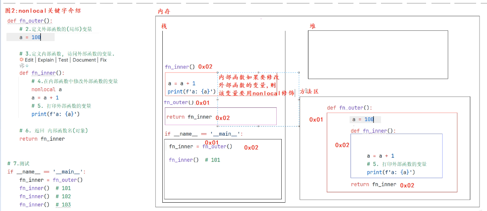
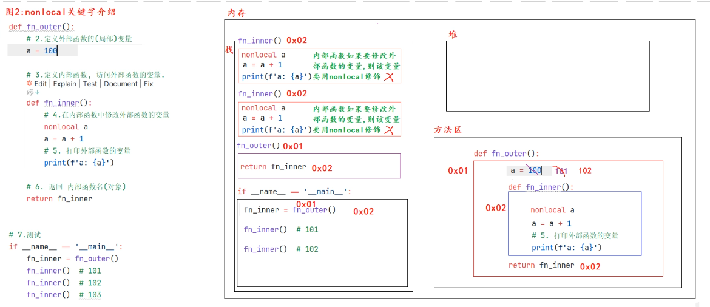

👉 [返回首页](/)

# 面向对象
    - 回答逻辑：概述，特点，举例，总结
## 编程思想
> 面向过程，面向对象，面向接口，面向函数式


面向对象基于面向过程
- 面向过程：以步骤为基础
- 面向对象：以对象为基础 
> 特点：更符合思考习惯； 复杂事情简单化； 程序员从执行者变成指挥者
> 总结：万物皆对象

# 特性（封装、继承、多态）

## 封装
- 概述：隐藏对象的属性和实现细节，仅对外提供公共的访问方式
- 举例：电脑手机，函数，类=属性+行为
- 好处：
    - 提高代码的安全性 （私有化）
    - 复用性

## 继承
- 概述：子类继承父类的属性和方法
- 好处：
    - 提高代码的复用性
- 弊端：耦合性

## 多态
- 概述：同一个函数，接收不同的对象，有不同的效果


class:
    属性，名词
    方法，动词


# 闭包
- 概述：函数嵌套函数，内层函数引用外层函数变量
- 有嵌套，有引用，有返回


## nonlocal 关键字




代码示例：
```python
def outer_fn():
    a=100

    def inner_fn():
        nonlocal a
        a += 1
        print("inner_fn 中输出 a:", a)
    return inner_fn

if __name__ == "__main__":
    fn_inner = outer_fn()
    fn_inner()
    fn_inner()
    fn_inner()
```
## 闭包的作用
- 保存函数中的变量（外部函数中的变量）

# 装饰器
- 概述：在不修改函数代码的前提下，给函数添加额外功能
- 本质是闭包函数
有嵌套，有引用，有返回，有额外功能


```python

def check_login(func): # func: 被装饰的函数名
    # 1.1. 定义内部函数， 实现登录功能
    def fn_inner():
        # 1.2 额外功能
        print("校验登录...登录成功")
        # 1.3 访问原函数， 即调用原函数
        func()
    # 1.4 返回内部函数
    return fn_inner

```
两种写法：1.传统写法；2.语法糖写法
```python
# 传统写法
def comment():
    print("发表评论...")
comment = check_login(comment)
comment()

# 语法糖写法
@check_login
def comment():
    print("发表评论...")
comment()

```


# 深拷贝与浅拷贝
```python
import copy
copy.copy()      # 浅拷贝 只拷贝第一层
copy.deepcopy()  # 深拷贝 拷贝所有层
```

# 面试准备

## 进程线程协程
- 进程：资源分配的最小单位
- 线程：CPU调度的最小单位
- 协程：用户态的轻量级线程

### GIL
- 全局解释器锁
- 作用：是CPython的一种机制，保证同一时刻只有一个线程在执行Python字节码

GIL 是 CPython 的全局解释器锁
保证同一时刻只有一个线程执行字节码
简化内存管理、提升单线程性能
CPU 密集多线程没用
IO 密集有用
可用多进程或 C 扩展绕过


### 适用场景
- 用 协程 管理高并发 API 调用
- 用 多进程 处理 CPU 密集的推理或特征计算
- 用 线程 处理少量 IO 或阻塞库

- 进程独立内存，能并行，适合 CPU 密集
- 线程共享内存，但 Python 有 GIL
- 协程单线程调度，适合大量 IO 并发

### 单例模式
- 概述：一个类只能有一个实例
- 实现方式：
    - 装饰器
    - 元类
- 作用：节省资源，保证全局唯一


## 追问 1：你说说单例模式是什么？为什么要用？
你答：
单例模式保证一个类在一个进程内只有一个实例，并提供全局访问点。常用于配置、日志、数据库连接池、模型加载器这类“重资源/全局状态一致”的对象，避免重复初始化和资源浪费。

加分点：
补一句：Python 里“模块天然单例”，很多场景直接用模块就够了。


## 追问 2：你写的单例线程安全吗？为什么？

你答：
不一定。最常见的 ```__new__```/装饰器实现如果没有锁，多线程同时第一次创建时可能发生竞态条件，导致创建出多个实例。


## 追问 3：那你怎么让它线程安全？

你答：
在实例创建的临界区加锁，常见做法是“加锁 + 双重检查（Double-Checked Locking）”，避免每次调用都加锁带来的性能损耗。

加分点：
说明“锁只保护第一次创建”，后续读取直接返回 _instance。


## python如何通信
- 进程间通信：管道、队列、共享内存、套接字
- 线程间通信：共享内存、条件变量、事件、信号量
- 协程间通信：asyncio.Queue、asyncio.Event

进程间通信（IPC）方式：
- 管道（Pipe）：适合双向通信，简单高效
- 队列（Queue）：线程安全，适合多生产者多消费者场景
- 共享内存（Shared Memory）：适合大数据量传输，避免序列化开销
    - multiprocessing.Value/Array：简单数值/数组共享
    - multiprocessing.shared_memory：大块数据共享（避免反复 pickle 拷贝）
- 套接字（Socket）：适合分布式系统，跨机器通信

线程间通信方式：
- 共享内存：线程共享同一进程内存空间，直接读写
- 条件变量（Condition）：线程间同步，等待特定条件发生
- 事件（Event）：线程间通知，设置和等待事件状态
- 信号量（Semaphore）：控制对共享资源的访问数量

协程间通信方式：
- asyncio.Queue：异步队列，做任务管道，适合生产者消费者模式
- asyncio.Event：异步事件，协程间通知和同步


## 如何防止死锁
统一加锁顺序 + 尽量保持更少的锁，例如只持有一个锁（缩小临界区；必要时加超时失败回退。
死锁四个必要条件：互斥，占有并等待，不可剥夺，循环等待

## 装饰器
- 概述：在不修改函数代码的前提下，给函数添加额外功能
- 本质是闭包函数
在日志、权限、缓存、重试场景非常有用
例如给原函数加日志 + 计时
如果不用装饰器每个函数都要修改，并且都要加上重复代码，业务逻辑被污染，同时修改时每个都要修改


## 如何将字典里的东西写入txt文件
字典写入 txt 可以逐行写 key-value；

工程上我更常用 JSON，json.dump，格式规范、可读、可恢复；

```python
import json
data = {"name": "Alice", "age": 20, "score": 95}
with open("data.txt", "w", encoding="utf-8") as f:
    json.dump(data, f, ensure_ascii=False, indent=2)
```

（指定 utf-8 编码避免中文乱码。）


