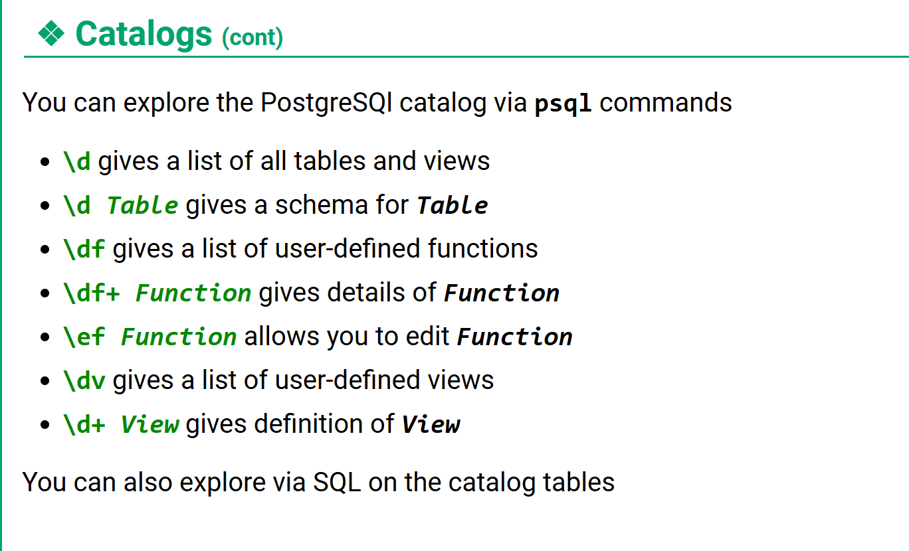
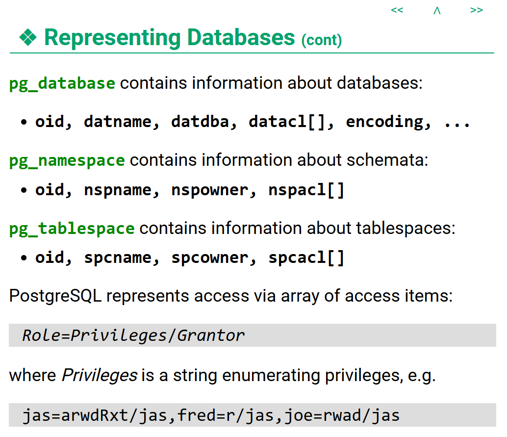
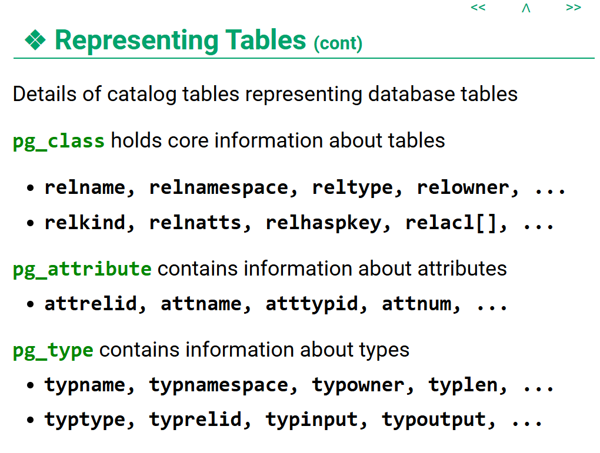

👉 [返回首页](/)


SELECT 字段
FROM 表
WHERE 条件
GROUP BY 分组字段
HAVING 分组条件
ORDER BY 排序字段
LIMIT 条数 OFFSET 偏移




# inportant pg tables:




## pg_database: （cluster级别）
- 存储所有数据库的信息。(在每一个数据库里都可以查这个表可以看到所有数据库的名字、所有者、编码等信息)
- 重要字段：oid（内部ID）、datname（数据库名）、datdba（数据库拥有者的OID）、encoding（数据库编码）、datacl（数据库权限数组）

## pg_namespace: 
- 存储 schema 信息。
- 重要字段：oid（schema OID）、nspname（schema 名称）、nspowner（schema 拥有者OID）、nspacl（schema权限数组）
- 用法：关键关系 pg_class.relnamespace -> pg_namespace.oid

## pg_tablespace: 
- 存储 tablespace 信息。Tablespace = 表存储在哪个磁盘目录。
- 重要字段：oid（tablespace ID）、spcname（tablespace 名称）、spcowner（tablespace 拥有者OID）、spcacl（权限数组）
- 用法：关键关系 pg_class.reltablespace -> pg_tablespace.oid

## pg_class: 最重要！！！
- 存储所有“表状对象”。包括：表、索引、视图、序列、toast 表
- 重要字段：oid（表的内部ID）、relname（表名）、relnamespace（表所属的 schema 的 OID）、relkind（表的类型：r=普通表、i=索引、S=序列、v=视图、m=物化视图、c=复合类型、t=TOAST 表）、relowner（表的拥有者 OID）、relnatts（列表）、reltuples（估计行数）、relacl（权限）
- 用法：
    - pg_class.relnamespace -> pg_namespace.oid
    - pg_class.reltablespace -> pg_tablespace.oid
    - g_attribute.attrelid → pg_class.oid
    - pg_type.typrelid → pg_class.oid

## pg_attribute: 重要！！！
- 存储列信息。每个列一行。
- 重要字段：attrelid（列所属表的 OID）、attname（列名）、atttypid（列的数据类型 OID）、attnum（列的序号，从1开始，系统列为负数）、attnum（列编号）、attnotnull（是否 NOT NULL）、atthasdef（是否有默认值）、attidentity（是否是 identity 列）、attgenerated（是否是 generated 列）、attisdropped（是否被删除了）
- 关键：
    - attrelid = 哪张表
    - atttypid = 什么类型

## pg_type: 重要！！！
- 存储所有类型。
包括：基础类型（int, text）, enum, 表的复合类型, domain
- 重要字段：oid（类型 OID）、typname（类型名）、typnamespace（类型所属的 schema OID）、typowner（类型拥有者 OID）、typlen（类型长度）、typtype（类型类别：b=基础类型(base)、c=复合类型(composite)、d=域(domain)、e=枚举(enum)、p=pseudo）、typrelid（如果是复合类型的话，指向 pg_class.oid）、typinput（输入函数）、typoutput（输出函数）
- 用法：关键关系 pg_attribute.atttypid -> pg_type.oid

## 总结：
| 表             | 是什么       |
| ------------- | --------- |
| pg_database   | 有哪些数据库    |
| pg_namespace  | 有哪些schema |
| pg_tablespace | 存在哪个磁盘    |
| pg_class      | 有哪些表      |
| pg_attribute  | 表有哪些列     |
| pg_type       | 列是什么类型    |

```
pg_authid(rolname, rolsuper, rolinherit, rolcreaterole, rolcreatedb, rolcatupdate,
        rolcanlogin, rolreplication, rolconnlimit, rolpassword, rolvaliduntil)

pg_database(datname, datdba, encoding, datcollate, datctype, datistemplate,
        datallowconn, datconnlimit, datlastsysoid, datfrozenxid, datminmxid,
        dattablespace, datacl)

pg_namespace(nspname, nspowner, nspacl)

pg_class(relname, relnamespace, reltype, reloftype, relowner, relam,
        relfilenode, reltablespace, relpages, reltuples, relallvisible,
        reltoastrelid, reltoastidxid, relhasindex, relisshared, relpersistence,
        relkind, relnatts, relchecks, relhasoids, relhaspkey, relhasrules,
        relhastriggers, relhassubclass, relfrozenxid, relminmxid, relacl, reloptions)

pg_attribute(attrelid, attname, atttypid, attstattarget, attlen, attnum, attndims,
        attcacheoff, atttypmod, attbyval, attstorage, attalign, attnotnull,
        atthasdef, attisdropped, attislocal, attinhcount, attcollation, attacl,
        attoptions, attfdwoptions)

pg_type(typname, typnamespace, typowner, typlen, typbyval, typtype, typcategory,
        typispreferred, typisdefined, typdelim, typrelid, typelem, typarray,
        typinput, typoutput, typreceive, typsend, typmodin, typmodout, typanalyze,
        typalign, typstorage, typnotnull, typbasetype, typtypmod, typndims,
        typcollation, typdefaultbin, typdefault, typacl)
```


